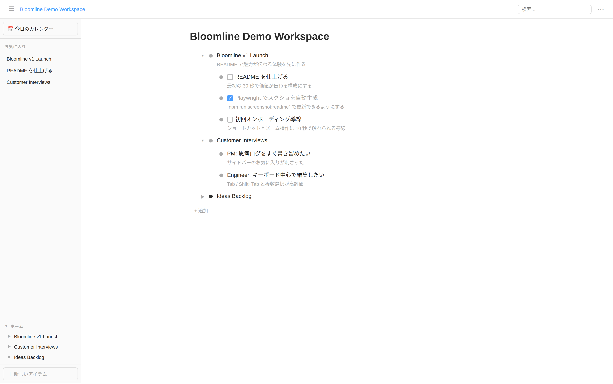

# Bloomline

ブラウザで動くアウトライナーです。単一の HTML ファイルとして配布されるため、ローカルに保存するだけで使えます。

## 特徴

- **シングルファイル配布** — Vite + vite-plugin-singlefile でビルドした `dist/index.html` ひとつで動作
- **データの永続化** — `localStorage` に自動保存。Chrome / Edge では File System Access API でファイルへの自動保存も可能
- **ゼロ依存** — ランタイム依存なし、純粋な TypeScript + DOM

## スクリーンショット



## 機能一覧

### 基本操作

| 操作 | 説明 |
|------|------|
| `Enter` | カーソル位置でノードを分割して新規追加 |
| `Backspace` | 空行削除 / 前の行に結合 / チェックボックスを外す |
| `Tab` / `Shift+Tab` | インデント / アウトデント |
| `⇧⌘↑` / `⇧⌘↓` | ノードを上 / 下に移動（`Alt+Shift+↑↓` でも可） |
| `Alt+Shift+→` / `Alt+Shift+←` | インデント / アウトデント（矢印キー版） |
| `⌘ Shift+BS` | ノードを子ごと削除 |

### ナビゲーション

| 操作 | 説明 |
|------|------|
| `↑` / `↓` | 上下のノードへ移動 |
| `● クリック` / `Alt+→` | そのノードにズームイン |
| `Alt+←` | ズームアウト |
| `Escape` | 選択解除 |
| `⌘→` | 親ノードを折りたたんで親へ移動 |

### 折りたたみ

| 操作 | 説明 |
|------|------|
| `▼ クリック` | 折りたたむ / 展開する |
| `Ctrl+Space` | 折りたたみをトグル |
| `Ctrl+↑` | たたむ |
| `Ctrl+↓` | 展開する |

### TODO

`[ ] ` と入力してスペースを押すとチェックボックスに変換されます。

| 操作 | 説明 |
|------|------|
| `⌘ Enter` | 完了 / 未完了をトグル |
| `⌘ O` | 完了タスクを非表示 / 再表示（状態は保存される） |

完了済みノードの子孫はグレーアウトされます。

### 検索

| 操作 | 説明 |
|------|------|
| `⌘ F` | 検索ボックスにフォーカス |
| 文字入力 | 現在のビュー内を絞り込み（マッチ部分はハイライト） |
| `Shift+Enter` | フラット検索モード — Home からの全ノードを対象に検索 |

**フラット検索**では、同じ親を持つ結果がグルーピングされ、各グループのヘッダーに「Home › 親 › ...」という経路がグレーで表示されます。結果をクリックまたは Enter で選択すると、そのノードの場所にジャンプします。フラット検索中も `↑↓` でキーボードナビゲーションできます。

### 複数選択

`Shift+クリック` または行上でドラッグすると複数行を選択できます。

| 操作 | 説明 |
|------|------|
| `Shift+↑↓` | 選択範囲を上 / 下に拡張 |
| `Tab` / `Shift+Tab` | 選択ノードを一括インデント / アウトデント |
| `Backspace` | 選択ノードを一括削除 |
| `⌘ C` | 選択ノードをコピー（ツリー構造ごと） |
| `⌘ X` | 選択ノードをカット（ツリー構造ごと） |
| `⌘ V` | コピー / カットしたノードをペースト |

### ノート

`Shift+Enter` で各ノードにメモを追加できます。ノートは行の下に表示されます。`Shift+Enter` または `Escape` でノード本文に戻ります。

### インライン記法

フォーカスを外すと自動的にレンダリングされます。

| 記法 | 表示 |
|------|------|
| `**テキスト**` | **太字** |
| `*テキスト*` | *斜体* |
| `__テキスト__` | <u>下線</u> |
| `[テキスト](URL)` | クリッカブルリンク |
| `https://...` | URL を自動リンク化 |
| 画像 URL | インラインプレビュー |

書式ショートカット（`⌘ B` / `⌘ I` / `⌘ U`）でも適用できます。

### ドラッグ&ドロップ

`●` ドットをドラッグしてノードを移動できます。ドロップ位置により「前に挿入」「後に挿入」「子にする」を切り替えます。サイドバーのドロップゾーンにドラッグするとお気に入りに追加できます。

### お気に入り・サイドバー

左サイドバーにお気に入りノードとホームツリーを表示します。

### カレンダー

「📅 今日のカレンダー」ボタンで年 › 月 › 日 の階層ノードを自動生成します。

### ファイル管理（Chrome / Edge のみ）

| メニュー項目 | 説明 |
|-------------|------|
| ファイルを開く | `.json` ファイルを開き、以降の変更を自動保存 |
| ファイルに保存 | 保存先を選択して自動保存を開始 |

File System Access API 非対応ブラウザではメニュー項目がグレーアウトされます。

### エクスポート / インポート

| 形式 | 説明 |
|------|------|
| テキスト (`.txt`) | インデント付きプレーンテキスト |
| JSON (`.json`) | フルデータ（インポート可） |
| OPML (`.opml`) | アウトライナー標準フォーマット |

### Undo / Redo

| 操作 | 説明 |
|------|------|
| `⌘ Z` | 元に戻す |
| `⌘ Shift+Z` / `⌘ Y` | やり直し |

ブラウザの「戻る / 進む」ボタンでズーム履歴も操作できます。

### Mac Emacs キーバインド

Mac では以下の Emacs 風バインドが使えます。

| キー | 動作 |
|------|------|
| `Ctrl+B` / `Ctrl+F` | カーソル左 / 右 |
| `Ctrl+A` / `Ctrl+E` | 行頭 / 行末 |
| `Ctrl+P` / `Ctrl+N` | 上のノード / 下のノードへ |
| `Ctrl+D` | 前方削除 |
| `Ctrl+H` | 後方削除 |
| `Ctrl+K` | 行末まで削除 |

## 開発

```bash
npm install

# 開発サーバー起動
npm run dev

# 本番ビルド (dist/index.html に単一ファイル出力)
npm run build

# テスト
npm test

# README 用スクリーンショットを生成
npm run playwright:install
npm run screenshot:readme
```

`npm run screenshot:readme` は `scripts/demo-state.json` をアプリに注入して `docs/images/readme-demo.png` を更新します。README の画像も自動でこのファイルを参照します。

## 技術スタック

- **TypeScript** + **Vite** — ビルドツール
- **vite-plugin-singlefile** — JS / CSS をインラインにして単一 HTML へ
- **vitest** — ユニットテスト（`keyHandlers`, `nodeHelpers`, `model`）
- ランタイムライブラリなし

## ライセンス

[LICENSE.md](LICENSE.md) を参照してください。
